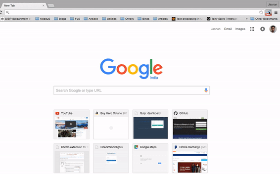

# What is Genie Multi-Search?

Genie Multi-Search is a free, open-source, google chrome browser extension. It helps language learners(aspiring polygots) to make word research faster.

# Why this Extension?

To learn a language as per the learning methods mentioned in [Fluent-Forever](http://fluent-forever.com/), you have to get atleast 4 resources (Image, Pronounciation audio, Bilingual, Monolingual dictionary entries) for a new word. Typically, it’s a bit of a pain to set up the above mentioned multi-search behavior in Chrome using Macros. So I have decided to write one that makes it a lot easier.

# How to Use it?

Once you installed the extension, chrome will place a button for Genie at the top right corner of the address bar. When you click on it, it will ask you “Which word do you want to look up?” and "Which language are you learning?". Hit search button, and within in seconds it opens a number of tabs based on your settings for the given language. 

As an eample, for the french language, You will get a Google Images link to the word, a Forvo.com recording to download the pronunciation, a bilingual dictionary entry and a monolingual dictionary (wordreference.com) entry. Magic! 

